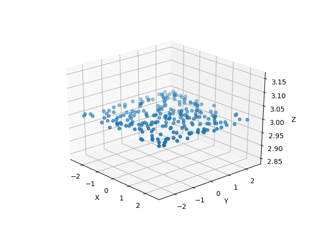

.. _coll-plate-top:

Collimator Plates
===================

Collimator Plates are Flat Components, but they are specialized to handle complicated ways of eliminating photons which hit them. They can be used as pieces of a large Collimator, or individually to function as an Aperture.

Creating a Collimator Plate
-------------------------------

A Collimator Plate requires the following arguments:

* x,y,z - The spatial coordinates of the center of the plate. See :ref:`Flat Component <flat-component-definition>`
* nx,ny,nz - The components of the normal vector. See :ref:`Flat Component <flat-component-definition>`
* sx,sy,sz - The components of the surface vector. See :ref:`Flat Component <flat-component-definition>`
* l - The length of the Collimator Plate. This is the extent of the Component in the direction of the surface vector
   * If l is None, the length and width of the Collimator Plate will not be considered. That is, the Component will extent infinitely in both direction. If it is not None, it must be in units of length. See the section on Astropy Units.
* w - The width of the Collimator Plate. This is the extent of the Component in the direction of the cross product of the surface and normal vectors (sxn).
   * If w is not None, it must be in units of length. See the section on Astropy Units.
* collisionfunction - A function that defines how photons will be removed from the surface. More on this in a later section.

Also, if you have one Collimator Plate, you can use the copy() function to create another identical one:

.. code-block:: python

   # define coll elsewhere
   copiedplate = coll.copy()

Note: parameters other than the ones given during initialization (such as those given for a collision function) will not be copied, i.e: if you define coll.sep for a collision function, copiedplate will not have a sep parameter defined.

Moving a Collimator Plate
----------------------------

Collimator Plate objects inherit translate, rotate, and unitrotate from Flat Component, see the function usage :ref:`here <flat-component-motion>`

:ref:`Back to Top<coll-plate-top>`

Trace
-----------

Trace is a function of all descendents of Flat Component. When called, rays will be traced to the surface and photons will be eliminated according to the dimensions and collision function of the Collimator Plate. If this Collimator Plate is in an Instrument object which is then simulated, trace() will be called automatically.

Trace takes the following inputs:

* rays - The Rays object which you want to trace to the Plate.
* considerweights - This is a boolean which should be true if your photons are weighted. It does not have any effect on Collimator Plates.
* eliminate - This is an argument of every trace function. It is a string which defaults to "remove". If it is the default value, photons which are eliminated will be removed from the Rays object. If it is anything else, the x-position of the missed photons will be set to NaN. This argument is mostly used by Combination objects.

The Trace function will modify the Rays object in place. It will return a tuple that gives information about how many photons made it to the detector. This tuple is used by Instrument objects to analyze the efficiency of the entire Instrument.

.. _coll-funcs:

Collision Functions
--------------------

Collimator Plates have two ways to remove rays once they've been traced. First, if l and w have been defined, the Collimator Plate object will be treated as an l by w rectangle, and any photons which fall outside of this rectangle will be eliminated.

For example, this image is of a Collimator Plate with length 5 and width 5.

The user can also define their own collision functions which take in rays and return an array of which photons should be removed.

:ref:`Back to Top<coll-plate-top>`

Using Existing Collision Functions:
************************************

Before we define our own collision functions, we should know how to use collision functions that come with PRTP. The most common of which is known as "wires." This function behaves as many thin parallel wires which run in the direction of the surface vector and eliminate any photons which collide with them.

When defining collision functions, we run into an issue. Since the collision functions are most commonly called by an Instrument object, there is no time where the user can input custom arguments while the simulation is running. Therefore, the Collimator Plate object must have all of the parameters it needs before the simulation is begun.

The wires function has two parameters, it requires the thickness of the wires, and their separation. Since they cannot be given as arguments to the collision function, they must be defined as parameters beforehand.

The following block of code shows how this is done. Note that the name of the parameters is very important, separation must be given as "c.sep" and thickness must be given as "c.thickness" or else the code will not run.

.. code-block:: python

   from prtp.CollimatorPlate import CollimatorPlate
   import astropy.units as u
   c = CollimatorPlate(x=0,y=0,z=0,nx=0,ny=0,nz=1,sx=0,sy=1,sz=0)
   c.collisionfunction = CollimatorPlate.wires
   c.thickness = 1 * u.mm
   c.sep = 2 * u.mm

When rays are traced to this CollimatorPlate, they will look something like this:

.. figure:: ../images/collplate_basic_wires.png

Also note that there is a wire running down the center of the plate. This is true of all Collimator Plates using the wires collision function.

If both a collision function and length/width are defined, then both will be applied to the Collimator Plate. 

.. code-block:: python

   from prtp.CollimatorPlate import CollimatorPlate
   import astropy.units as u
   c = CollimatorPlate(x=0,y=0,z=0,nx=0,ny=0,nz=1,sx=0,sy=1,sz=0,
   l=6*u.mm,w=8*u.mm)
   c.collisionfunction = CollimatorPlate.wires
   c.thickness = 1 * u.mm
   c.sep = 2 * u.mm

:ref:`Back to Top<coll-plate-top>`

Define Your Own Collision Functions
***********************************

There are a few important notes to consider before defining your own collision function:

* Any collision function must take the same arguments, self and rays. self will refer to the Collimator Plate, and rays will be a Rays object.

   * But other arguments can be called from the Collimator Plate's parameters, like thickness and separation for the wires function.

* The output of a collision function must be an array of booleans containing True if the photon is to be removed and false if the photon is to be kept.

As an example, let's define a collision function that removes photons in the shape of the thick ring. But since we may want more Collimator Plates to use this collision function in the future, let's make the inner and outer radii of the ring arbitrary.

Step 1: The function

.. code-block:: python

   import numpy as np
   import astropy.units as u
   from prtp.CollimatorPlate import CollimatorPlate

   # Begin the function definition, 
   # note the arguments must be self and rays.
   def circle(self, rays):

      # We can use the self argument to 
      # recover the positions of the photons
      x,y = self.getPosns(rays)

      # Now get the distance from the center of each photon
      r = np.sqrt(x**2 + y**2)

      # Get the inner and outer radii, the user should define
      # these with units. If they are not, an error will be raised.
      # Here we will also convert the units to standard units (mm)
      rin = self.rin.to(u.mm).value
      rout = self.rout.to(u.mm).value

      # This line will create an array of True where photons fall
      # within the ring and False otherwise 
      arr = np.logical_and(r > rin, r < rout)

      return arr

Step 2: Adding the function to a CollimatorPlate

This code will be very similar to the code we used for the wires function. Also note that this should be in the same script in which you defined the circle function.

.. code-block:: python

   c = CollimatorPlate(x=0,y=0,z=0,nx=0,ny=0,nz=1,sx=0,sy=1,sz=0,
   l=6*u.mm,w=8*u.mm)
   c.collisionfunction = circle
   c.rin = 1 * u.mm
   c.rout = 2 * u.mm

After Tracing rays to the surface, we can see how photons were removed by the ring:

Since we defined rin and rout as arbitrary parameters. It is now easy to add this collision function to other Collimator Plates with different sized rings.

:ref:`Back to Top<coll-plate-top>`

