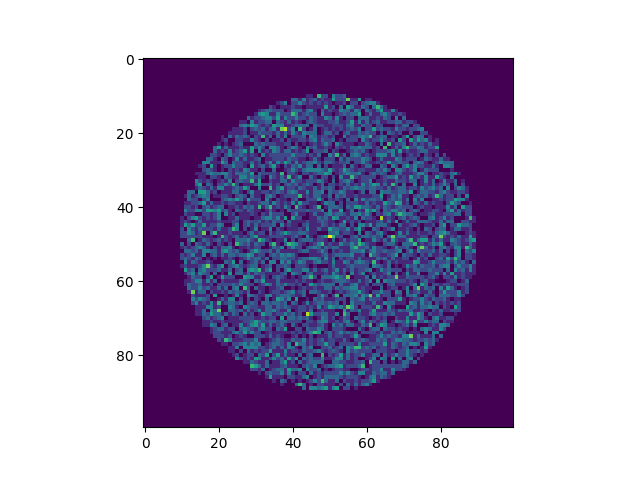
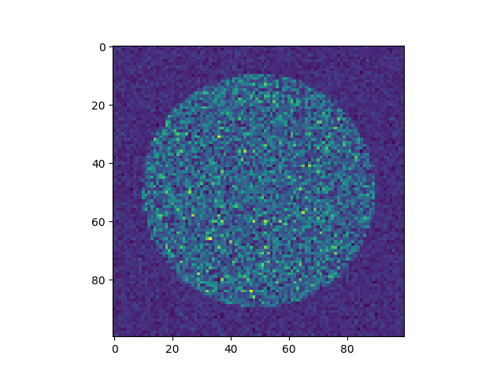
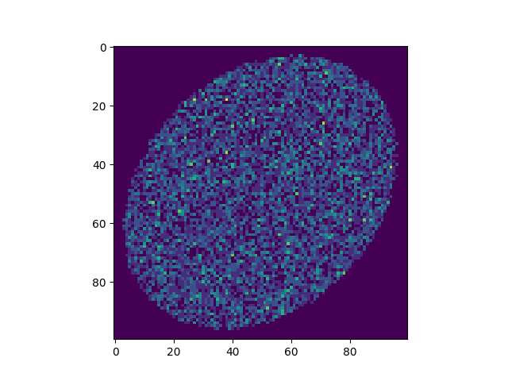

.. _detector-top:

Detectors
===================

Detectors are Flat Components, when photons are traced to them, these photons are binned into pixels which can then be viewed. In the future, detectors will be able to simulate noise and interactions such as split events. Then you will be able to use detectors in your Instrument to generate sample data and test your data analysis or event detection beforehand.

Creating a Detector
-------------------------------

A Collimator Plate requires the following arguments:

* x,y,z - The spatial coordinates of the center of the plate. See :ref:`Flat Component <flat-component-definition>`
* nx,ny,nz - The components of the normal vector. See :ref:`Flat Component <flat-component-definition>`
* sx,sy,sz - The components of the surface vector. See :ref:`Flat Component <flat-component-definition>`
* q - The quantum efficiency of the detector. This input should be a float that ranges from 0 to 1, it defaults to 1. This quantity specifies the probability that a given photon will be detected if it impacts the Detector.
* l - The length of the Collimator Plate. This is the extent of the Component in the direction of the surface vector
   * l must be in units of length. See the section on Astropy Units.
* w - The width of the Collimator Plate. This is the extent of the Component in the direction of the cross product of the surface and normal vectors (sxn).
   * w must be in units of length. See the section on Astropy Units.
* xpix - The number of pixels along the width of the axis, i.e: how many pixels lie along a line parallel to the x-unit vector (the surface-cross-normal vector).
* ypix - The number of pixels along the length of the axis, i.e: how many pixels lie along a line parallel to the y-unit vector (the surface vector).

.. warning::
   Unlike other Flat Components, Detectors MUST have a length and width defined. If no arguments are passed, these dimensions will both default to 1 mm.
   

Moving a Detector
----------------------------

Detector objects inherit translate, rotate, and unitrotate from Flat Component, see the function usage :ref:`here <flat-component-motion>`

:ref:`Back to Top<detector-top>`

Trace
-----------

Trace is a function of all descendents of Flat Component. When called, rays will be traced to the surface and any photons which fall outside of the detector's range will be removed. If placed in an Instrument object and simulated, trace will be called automatically.

Trace takes the following inputs:

* rays - The Rays object which you want to trace to the Detector.
* considerweights - This is a boolean which should be true if your photons are weighted. If True, it will be the photon's weights which are affected by the Detector's quantum efficiency, so no photons will be removed from the Rays object. See the section on photon weighting.
* eliminate - This is an argument of every trace function. It is a string which defaults to "remove". If it is the default value, photons which miss the detector will be removed from the Rays object. If it is anything else, the x-position of the missed photons will be set to NaN. This argument is mostly used by Combination objects.

The Trace function will modify the Rays object in place. It will return a tuple that gives information about how many photons made it to the detector. This tuple is used by Instrument objects to analyze the efficiency of the entire Instrument.

Add Gaussian Noise
-----------------------

The function addGaussianNoise adds noise to the pixel array for more accurate simulations.

addGaussianNoise takes the following inputs:

* mean - The mean of the normal distribution being added to the array, defaults to 0.
* std - The standard deviation of the normal distribution being added to the array, defaults to 1.

:ref:`Back to Top<detector-top>`

View
-------

The function view returns the pixel array. If you wish to have photons on the pixel array, you must specify the Rays object when calling view.

view takes the following arguments:

* rays - The Rays object you want to include on the Detector's surface. This argument defaults to None, in which case no photons will be included but the array will still be returned.
   * The Detector cannot tell if the Rays have been traced to the surface before calling view. If you call view before tracing Rays, you will still see the photons, but they will not be in the correct locations.

Note: Once you have the pixel array, the best way to see it is to use pyplot's "imshow" function, see examples at the bottom of this page.

Reset
--------

The function reset takes no arguments and sets all of the pixel values back to 0.

:ref:`Back to Top<detector-top>`

Examples
---------

Basic Photon Trace
**********************

This example will trace a circular beam of photons to a Detector's surface and then plot them.

.. code-block:: python

   import matplotlib.pyplot as plt
   from prtp.Detector import Detector
   import astropy.units as u
   
   # Rays have been defined in a circular beam elsewhere

   d = Detector(x=0*u.mm,y=0*u.mm,z=2*u.mm,
      nx=0,ny=0,nz=1,sx=0,sy=1,sz=0,q=1.,
      l=10*u.mm,w=10*u.mm,xpix=100,ypix=100)

   d.trace(rays)
   arr = d.view(rays)

   plt.figure()
   plt.imshow(arr)
   plt.show()

When executed, the code produces the following plot:

As it was defined, this detector has dimensions 10mm x 10mm and has 100 pixels on a side.

Photon Trace with Noise
**************************

This example will perform the same trace as before but with Gaussian noise added beforehand.

.. code-block:: python

   import matplotlib.pyplot as plt
   from prtp.Detector import Detector
   import astropy.units as u
   
   # Rays have been defined in a circular beam elsewhere

   d = Detector(x=0*u.mm,y=0*u.mm,z=2*u.mm,
      nx=0,ny=0,nz=1,sx=0,sy=1,sz=0,q=1.,
      l=10*u.mm,w=10*u.mm,xpix=100,ypix=100)

   d.trace(rays)
   d.addGaussianNoise(mean=1,std=1)
   arr = d.view(rays)

   plt.figure()
   plt.imshow(arr)
   plt.show()

Note that the call to addGaussianNoise() could have been performed before or after the call to trace(), so long as view() was called last.

Misaligned Photon Trace
**************************

This example will trace photons that do not hit the detector dead on, rather, the detector is at a slight angle with respect to the incoming photons.

.. code-block:: python

   import matplotlib.pyplot as plt
   from prtp.Detector import Detector
   import astropy.units as u
   
   # Rays have been defined in a circular beam elsewhere

   d = Detector(x=0*u.mm,y=0*u.mm,z=2*u.mm,
      nx=0,ny=0,nz=1,sx=0,sy=1,sz=0,q=1.,
      l=10*u.mm,w=10*u.mm,xpix=100,ypix=100)

   d.rotate(theta=40*u.deg,ux=1,uy=1,uz=0)

   d.trace(rays)

   arr = d.view(rays)

   plt.figure()
   plt.imshow(arr)
   plt.show()

:ref:`Back to Top<detector-top>`

