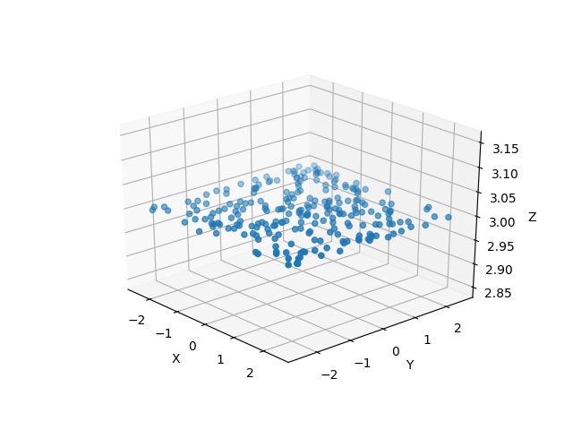
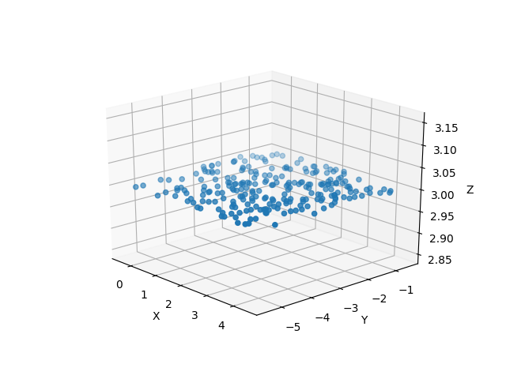
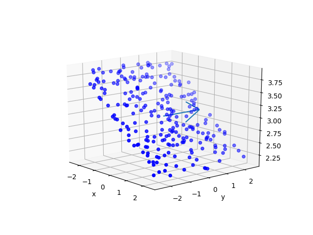
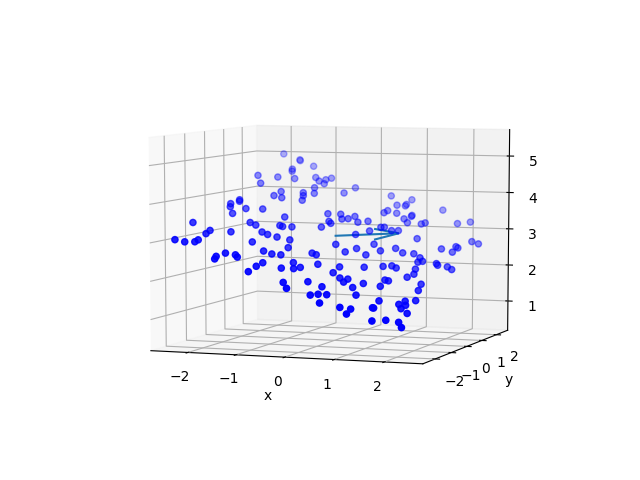
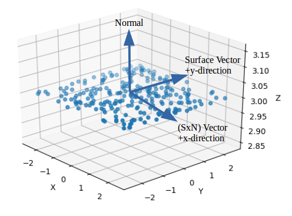

.. _flat-comp-top:

Flat Components
=======================

The term Flat Component is a blanket term for any Component that can be defined in a single plane. Currently, the following components are FlatComponents:

* :ref:`Collimator Plates<coll-plate-top>`
* :ref:`Detectors<detector-top>`
* :ref:`Gratings<grating-top>`

All Flat Component descend from this class. Though the FlatComponent superclass can be initialized, these objects lack a trace function, and therefore cannot be used in Instrument objects. The following sections describe functions and parameters that are shared by all Flat Components.

Creating a Flat Component
---------------------------

.. _flat-component-definition:

A Flat Component requires the following arguments

* x,y,z - The position in Cartesian Coordinates of the center of the Component.
   * These parameters must be in units of length. See the section on Astropy Units.
* nx,ny,nz - These three quantities describe the normal vector, extending outward from the Component's surface. nx, ny, and nz describe the distance that the vector extends in the x, y, and z directions, respectively.
* sx,sy,sz - These three quantities describe a surface vector. For some components (like Gratings), the surface vector represents a very specific direction. But for most Flat Components, the surface vector just helps the user orient the component. sx, sy, and sz describe the distance that the vector extends in the x, y, and z directions, respectively.
* collfunc - A function that describes how photons impact and are removed by this Component. Though every Flat Component object can have a collisionfunction, they are used most extensively by CollimatorPlate objects. See the section on :ref:`Collision Functions<coll-funcs>`

For an illustration of the vectors which define a Flat Component, see the graphic :ref:`here<flat-comp-vectors>`

For example, a Flat Component could be initialized using the following syntax:

.. code-block:: python

   from prtp.FlatComponent import FlatComponent
   import astropy.units as u
   f = FlatComponent(x=0*u.mm,y=0*u.mm,z=0*u.mm,nx=0,ny=0,nz=1,sx=1,sy=0,sz=0)

Tracing rays to the Components reveals information about its surface:

   Rays traced to the basic FlatComponent we just initialized. Note that this image shows a Component that has finite x and y dimensions, these parameters are supported by many subclasses of Flat Component but not in Flat Component instances. Also note that tracing Rays requires the use of Instrument objects, the code for which has been omitted here.

:ref:`Back to Top<flat-comp-top>`

.. _flat-component-motion:

Translate
--------------

translate(self,dx=0*u.mm,dy=0*u.mm,dz=0*u.mm)

This function moves the center of the component in space, it takes arguments:

* dx,dy,dz - The amount by which you want to move the Component's center in the x, y, and z directions, respectively.
   * These parameters must be in units of length. See the section on Astropy units

Example: Take the Flat Component we defined before and move it 2 mm in x and -3 mm in y.

.. code-block:: python

   from prtp.FlatComponent import FlatComponent
   import astropy.units as u
   f = FlatComponent(x=0*u.mm,y=0*u.mm,z=0*u.mm,nx=0,ny=0,nz=1,sx=1,sy=0,sz=0)
   f.translate(dx=2*u.mm,dy=-3*u.mm)

Building an instrument and tracing photons to this Component shows that the center has indeed been moved to (x,y,z) = (2,-3,3)

:ref:`Back to Top<flat-comp-top>`

Unit Rotate
---------------

unitrotate(self,theta=0*u.rad,axis=1)

This function rotates the Flat Component about one of the unit axes. It takes arguments:

* theta - The amount that you want to rotate about the specified axis.
    * This parameter must be in units of angle. See the section on Astropy units
* axis - An integer that should take the values 1,2, or 3. 
   * If axis = 1: The Component will be rotated about the x-axis
   * If axis = 2: The Component will be rotated about the y-axis
   * If axis = 3: The Component will be rotated about the z-axis

Note: All rotations are performed in a right-handed fasion, that is, according to the right hand rule where your thumb is the axis of rotation and your fingers curl in the direction of positive rotation.

Example: Let's take the Flat Component we defined at first and rotate it 20 degrees about the y-axis.

.. code-block:: python

   from prtp.FlatComponent import FlatComponent
   import astropy.units as u
   f = FlatComponent(x=0*u.mm,y=0*u.mm,z=0*u.mm,nx=0,ny=0,nz=1,sx=1,sy=0,sz=0)
   f.unitrotate(theta=20*u.deg,axis=2)

We can then see (using traced rays) how the Component has been rotated:

   The blue arrow in this image represents the axis of rotation (here the positive y axis)

:ref:`Back to Top<flat-comp-top>`

Rotate
-----------

rotate(self,theta=0*u.rad,ux=1,uy=0,uz=0)

This function rotates the Flat Component about an arbitrary, user-defined axis. It takes arguments:

* theta - The amount that you want to rotate about the user-defined axis.
    * This parameter must be in units of angle. See the section on Astropy units
* ux,uy,uz - These three parameters define the axis about which you want to rotate. ux, uy, and uz describe the distance that the vector extends in the x, y, and z directions, respectively.

Note: The rotation is performed in a right-handed fasion, that is, according to the right hand rule where your thumb is the axis of rotation and your fingers curl in the direction of positive rotation.

Note: The magnitude of the vector does not matter, only its direction.

Example: Let's take the Flat Component we defined at first and rotate it 40 degrees about the vector <1,1,0>

.. code-block:: python

   from prtp.FlatComponent import FlatComponent
   import astropy.units as u
   f = FlatComponent(x=0*u.mm,y=0*u.mm,z=0*u.mm,nx=0,ny=0,nz=1,sx=1,sy=0,sz=0)
   f.rotate(theta=40*u.deg,ux=1,uy=1,uz=0)

This produces a Flat Component that looks something like this:

   The blue arror represents the axis of rotation, here it is the vector <1,1,0>

Flat Component objects have several more functions, but these are primarily called by other objects when tracing rays.

:ref:`Back to Top<flat-comp-top>`

Coordinates
---------------

Flat Components can be arbitrarily positioned in space and can be arbitrarily oriented in space. For this reason, we need a coordinate system that easily describes photons when they're on the surface. Since Flat Components occupy a plane, we need only to define i and j unit vectors to create a Cartesian Plane.

On the surface of the Flat Component, we define the cross product of the surface vector and the normal vector as the i unit vector. We also define the surface vector as the j unit vector.

Therefore, when photons have been traced to the surface of the Flat Component, their positions can be described with just an x and a y coordinate.

The image below shows how the vectors can define a Cartesian Plane:

.. _flat-comp-vectors:

Getting Coordinates
********************

If you have some rays and a flat component initialized. You must first trace the rays to the surface of the component, then you can calcluate the positions of each photon:

.. code-block:: python

   # rays and flat have been defined elsewhere

   # trace rays to surface
   flat.trace_to_surf(rays)

   # get the x and y positions of each photon
   x,y = flat.getPosns(rays)

These coordinates are very important for all of the subclasses of FlatComponent

:ref:`Back to Top<flat-comp-top>`

