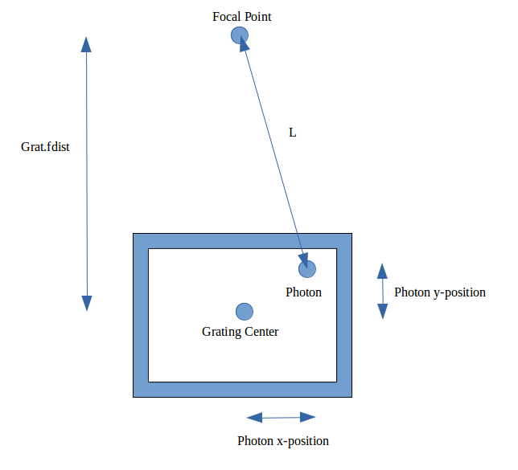

.. _grating-top:

Gratings
===================

Gratings are Flat Components, they are used to reflect and diffract photons that they interact with. There are two main classes of gratings, parallel and radial.

Creating a Grating
-------------------------------

A Grating requires the following arguments:

* x,y,z - The spatial coordinates of the center of the grating. See :ref:`Flat Component <flat-component-definition>`
* nx,ny,nz - The components of the normal vector. See :ref:`Flat Component <flat-component-definition>`
* sx,sy,sz - The components of the surface vector. See :ref:`Flat Component <flat-component-definition>`
   * In gratings, the surface vector has a very specific definition. It is defined as the average groove direction. For parallel gratings, it is the same direction as every groove. For radial gratings, it is the same direction as the central groove. 
* l - The length of the Grating. This is the extent of the Grating in the direction of the surface vector, defaults to None.
   * If l is None, the length and width of the Grating will not be considered. That is, the grating will extent infinitely in both direction. If it is not None, it must be in units of length. See the section on :ref:`Astropy Units <units-top>`.
* w - The width of the Grating. This is the extent of the Grating in the direction of the cross product of the surface and normal vectors (sxn), defaults to None.
   * If w is not None, it must be in units of length. See the section on :ref:`Astropy Units <units-top>`.
* collfunc - A function that defines how photons will be removed from the surface. It is used in the same manner as a Collimator Plate's collision function, but is not typically used for Gratings. See the section on :ref:`Collision Functions<coll-funcs>`, defaults to None.
* pfunc - A function that determines the groove period that each photon experiences. If None, the Grating will be initialized as an ideal parallel or radial grating. See the section on period functions for more information. Defaults to None.
* radial - A boolean. If True, the Grating will be radial. If False, the Grating will be parallel. Defaults to True.
* d - The groove period at the center point of the Grating, defaults to 160 nm, the groove period for OGRE gratings. Defaults to 160 nm.
   * d must be in units of length, see the section on :ref:`Astropy Units <units-top>`.
* fdist - The distance to the Grating's focus. This parameter defaults to None and it only relevant for radial Gratings. Defaults to None
   * If fdist is not None, it must be in units of length, see the section on :ref:`Astropy Units <units-top>`.

Also, if you have one Grating, you can use the copy() function to create another identical one:

.. code-block:: python

   # define grat elsewhere
   copiedgrating = grat.copy()

Moving a Grating
----------------------------

Grating objects inherit translate, rotate, and unitrotate from Flat Component, see the function usage :ref:`here <flat-component-motion>`

:ref:`Back to Top<grating-top>`

Trace
-----------

Trace is a function of all descendents of Flat Component. When called, rays will be traced to the surface and photons will be eliminated according to the dimensions and collision function of the Grating. If this Grating is in an Instrument object which is then simulated, trace() will be called automatically.

Trace takes the following inputs:

* rays - The Rays object which you want to trace to the grating.
* considerweights - This is a boolean which should be true if your photons are weighted. It does not have any effect on Gratings currently, but in the future it will be useful for simulating the reflectivity of Gratings.
* eliminate - This is an argument of every trace function. It is a string which defaults to "remove". If it is the default value, photons which are eliminated will be removed from the Rays object. If it is anything else, the x-position of the missed photons will be set to NaN. This argument is mostly used by Combination objects.

The Trace function will modify the Rays object in place. It will return a tuple that gives information about how many photons made it to the detector. This tuple is used by Instrument objects to analyze the efficiency of the entire Instrument.

Period Functions
-------------------

Period functions (or pfuncs) are functions which take in a Rays object and the groove period experienced by each photon in the Rays object.

Important to note, all period functions should return periods in units of nanometers, but as a float data type. Period functions cannot return Astropy Quantities.

Furthermore, all period functions should have two inputs:

* self - Refers to the Grating itself
* rays - The Rays for which you will be producing groove periods

Period Function for Parallel Gratings
**************************************

We will start with the simpler case. In an ideal parallel grating, each photon experiences the exact same groove period. As an example, we will create a period function that adds Gaussian Noise to this groove period. But to make the example more challenging, we will specify that the standard deviation of the noise distribution depends on the distance of the photon from the center of the grating. Our grating will have an ideal period of 160 nm, but a photon 2 mm from the center will experience a groove period that follows a normal distribution with mean 160 nm and standard deviation 2 nm.

.. code-block:: python

   import numpy as np
   import astropy.units as u
   from prtp.Grating import Grating

   # Begin the function definition
   # Note it inputs self and rays.
   def noise(self,rays):

      # Gets the ideal period, gets its value since
      # it is currently an Astropy Quantity
      d = self.d.value

      # Gets the positions of the photons on the Grating
      x,y = self.getPosns(rays)

      # find the distance of each photon from the center
      r = np.sqrt(x**2 + y**2)

      # produce the groove periods using a mean of 0,
      # a standard deviation of y, and a length the same as
      # that of the rays object.
      ds = np.random.normal(d,y,len(rays))

      return ds

Then, if you have define some Grating grat, this function can be added as a period function using the syntax:

.. code-block:: python

   grat.periodfunction = noise

Now you can simulate the Grating using your custom period function.

:ref:`Back to Top<grating-top>`

Period Function for Radial Gratings
************************************

Finding the central period of the Grating
^^^^^^^^^^^^^^^^^^^^^^^^^^^^^^^^^^^^^^^^^^^^^

If a Grating has been defined with radial=True and d=160nm, it will not be true that every photon experiences a groove period of 160 nm. Radial Gratings work by first finding the quantity "d-per-mm". Which is defined as:

.. math::

   dpermm = \frac{Grat.d}{Grat.fdist}

This quantity says that if a photon is at a distance l away from the grating focus, it will experience a groove period of:

.. math::

   d = l*dpermm

So in order to find the period experienced by a certain photon, we must first find the distance from the focal point to that photon given the its x and y positions on the Grating. It is clear that the distance in x from the focus is still x, but the distance in y is Grat.fdist-y, see the diagram below:

Note that the surface vector points towards the focus, so a photon with a positive y-position is closer to the focal point. Using the diagram above, it is easy to see that the distance from a photon to the focal point is:

.. math::

   l = \sqrt{x^2 + (grat.fdist-y)^2}

Therefore, if we know that a certain photon experiences a grating period d, we can work backwards to find what the central period (grat.d) must be by combining the above equations into:

.. math::

   grat.d = \frac{d*grat.fdist}{\sqrt{x^2 + (grat.fdist-y)^2}}

This is important because the radial grating function takes in the central period for each photon, NOT the period at each photon's location. So a period function for a radial grating must return Grat.d as defined by the above equation. See the next section for an example of this.

Defining the Period Function
^^^^^^^^^^^^^^^^^^^^^^^^^^^^^^^

As an example, we will create a period function that turns a radial grating into a parallel grating. That is, every photon that strikes the grating will experience the same groove period.

Of course, this example would be trivial with a parallel grating, the period function would just return grat.d for every photon. But attempting this with a radial grating illustrates the difference between period functions for the two types of gratings.

We define the period function as such:

.. code-block:: python

   import numpy as np
   import astropy.units as u
   from prtp.Grating import Grating

   # Begin the function definition
   # Note it inputs self and rays.
   def parallel(self,rays):

      # Gets the ideal period, gets its value since
      # it is currently an Astropy Quantity
      d = self.d.value

      # Gets the positions of the photons on the Grating
      x,y = self.getPosns(rays)

      # find the distance of each photon from the focus
      dist = np.sqrt(x**2 + (self.fdist.value - y)**2)

      # use the equation we derived to find the central
      # period for each photon
      ds = d * grat.fdist.value / dist

      return ds

Then, if you have define some Grating grat, this function can be added as a period function using the syntax:

.. code-block:: python

   grat.periodfunction = parallel

:ref:`Back to Top<grating-top>`

