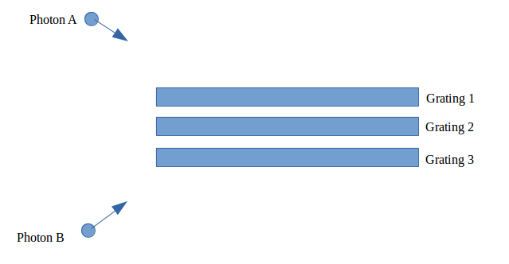

.. _grat-stack-top:

Grating Stacks
================================

Grating Stacks are a subclass of Combination. They are intended to only hold Flat Components and differ from general Combinations in that they have a special trace method.

General Combinations will trace rays to the components in the order in which they were added. Grating Stacks can trace with this same functionality, but also can use a type of trace known as "smartTrace." For each photon, this method traces to the closest compoenent first, then successively through each component until the farthest away one. Therefore the order in which the components were added does not matter at all. A further analysis of the smarttrace method is found in the section on the trace() function.

Creating a Grating Stack
----------------------------

A GratingStack takes the following arguments:

* rx, ry, rz - These specify the rotation point of the Grating Stack. These parameters can still be defined later using the function defineRotationPoint(). They all three default to None
   * rx, ry, and rz must all be in units of length, see the section on :ref:`Astropy Units <units-top>`
* keeporder - A boolean. If True, the order in which components were added will be used during traces. That is, this GratingStack will behave like a normal Combination when trace() is called. If False, the order in which components were added will be ignored. In this case, the GratingStack will use the smarttrace method when trace() is called, defaults to True.

Adding and Accessing Components
-----------------------------------

GratingStacks inherit :ref:`addComponent() <add-components>` and :ref:`getSubComponents() <get-subcomponents>` from the Combination class.

Also, the attributes of Gratings are very important, if you need to modify the attributes of a Grating after you've added it, refer to the :ref:`setAttribute() <set-attribute>` function from the Combination class.

:ref:`Back to Top<grat-stack-top>`

Moving Grating Stacks
-------------------------

Grating Stacks inherit all of their :ref:`in-place <in-place-motion>` and :ref:`bulk motion <bulk-motion>` from the Combination class. The only difference between the two with respect to motion is that the Grating Stack can define a rotation point when it is initialized.

Trace
----------

The general trace function is called in the same way as Combination's Trace function. It takes the same :ref:`arguments <comb-trace-args>` as a general Combination. However, Grating Stacks will decide to use default trace or smart trace based on the value of the keeporder parameter. To use smart trace, make sure that keeporder is set to True.

Smart Trace
***************

Smart Trace is a more sophisticated version of the standard Combination trace. The distance to each component is calculated for each photon, and each photon is traced to the closest component first. For this reason, Grating Stacks must only contain Flat Components, because it is not possible to determine the distance to other components.

For an example of Smart Trace, consider the following diagram:

Suppose the Gratings were added to the stack in the order Grating 1, Grating 2, Grating 3. Suppose we were trying to trace the two photons to the Grating Stack. 

If we used the default trace, both photons would be successfully traced to Grating 1 (the first Grating added) and with no photons remaining, the trace would finish without considering the other two gratings.

But this is obviously not what happens in reality, we can see that Photon A will hit Grating 1 and Photon B will hit Grating 3. If we used the smart trace (the Grating Stack was initialized with keeporder=True), Photon A would realize that Grating 1 is the closest component while Photon B would realize that Grating 3 is the closest component. With this algorithm, Photon A will be traced successfully to the closest Grating (Grating 1) while Photon B will be successfully traced to its closest Grating (Grating 3).

However, Smart Trace is a more complicated algorithm, and thus takes slightly more time to run. So it can be useful to see if your Grating Stack needs to be traced using this algorithm. However the time saved is not usually very significant.

:ref:`Back to Top<grat-stack-top>`

