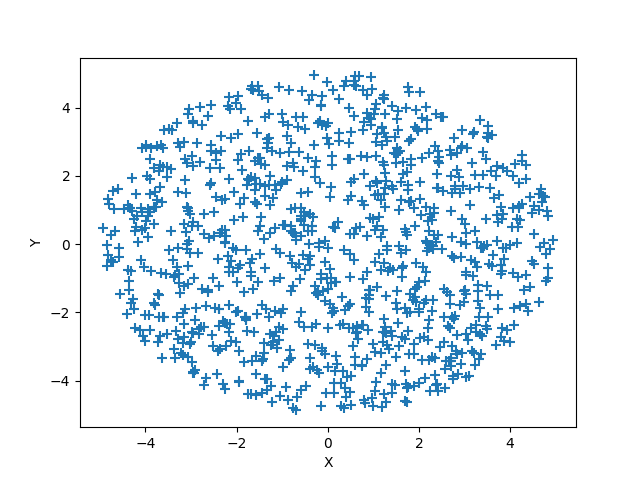

.. _rays-top:

Rays
===================

Rays are objects which store a group of photons, PRTP is based on manipulating these objects. Most of the operations provided by PRTP can be performed working exclusively with Components and using Rays objects rarely. But this page will provide the basic functions to modify and analyze Rays. The full class is very long and contains hundreds of functions. However the functions themselves are documented in the Rays.py file.

Parameters
-----------

Rays objects contain photons, and these photons need certain parameters in order to be fully described.

Note: Astropy units are handled entirely at the component level. They are never used by any functions or parameters in the Rays.py file. Therefore any time you work with Rays objects directly, make sure your values are in the default units (millimeters and radians) but do not have any units attached. For example, if you wished to translate some rays 2 meters in x. You would need to pass 2000 as the argument (an integer representing the value if it were converted to mm).

Rays Parameters:

* x, y, z - These parameters describe the position of the photon
* l, m, n - These parameters describe the components of the photon's direction
* ux, uy, uz - These parameters describe the components of the normal vector of the last surface with which the photon interacted.
* weights - If the photons are weighted, their weights are stored here. All photons start out with a weight of one. If they hit a detector with a quantum efficiency of 0.75, their weights are multiplied by 0.75. The weight represents the probability that a photon survived to this point.
* wave - The wavelength of the photons, in nm by default (while position values are in mm)
* order - The order of the photons, important when reflecting off gratings.

Length
--------

Rays objects have lengths which describe the number of photons they contain. There are two ways to find the length of the rays object:

The standard len() function that you would use for a list or 1D array:

.. code-block:: python

   length = len(rays)

The length() function. This function is needed if the photons are weighted. It takes as an argument "considerweights", a boolean. If False, if will consider every photon the same regardless of its' weight. If True, this function will return the sum of the photons' weights:

.. code-block:: python

   length = rays.length(considerweights=True)

:ref:`Back to Top<rays-top>`

Truth Arrays
--------------

Truth arrays are a very important concept when dealing with Rays objects and they will appear several times in this page. A truth array is simply a numpy array of booleans that has the same length as the rays object. They can be generated very easily (see examples)

Generating a solid trutharray (all the same value)

.. code-block:: python

   import numpy as np

   # suppose a rays object rays has been generated elsewhere

   # generate a trutharray that has True for every element
   trutharray = np.ones(len(rays)).astype(bool)

   # generate a trutharray that False for every element
   trutharray = np.zeros(len(rays)).astype(bool)

Generate a trutharray based on the photons' position

.. code-block:: python

   import numpy as np

   # suppose a rays object rays has been generated elsewhere

   # a comparison operator is all you need to generate a trutharray
   # this array will be true if the rays have a positive x-position
   trutharray = (rays.x > 0)

Combine two truth arrays:

.. code-block:: python

   # suppose a rays object rays has been generated elsewhere

   # we will find the rays with a positive x and a positive y
   tarray1 = (rays.x > 0)
   tarray2 = (rays.y > 0)

   # trutharrays need to be combined with numpy logical operators
   trutharray = np.logical_and(tarray1,tarray2)

:ref:`Back to Top<rays-top>`

Generating Rays
-------------------

The best way to generate rays is using a :ref:`Source <source-top>` object. But there a few methods that can be helpful to generate rays objects.

Copy
*******

The copy() function creates a copy of an existing Rays object. The copied object is a deepcopy of the original, so changing the original will not affect the copy, and vice versa.

Example:

.. code-block:: python

   from prtp.Rays import Rays()

   rays = Rays()

   copiedrays = rays.copy()

Split
*******

The split function copies some rays from an existing Rays object. Which photons are copied and which are left untouched is determined by a truth array. The truth array should be True for a photon which is to be copied and False if the photon is to be left alone. The split function does not affect the original Rays object but does create a new object.

Example:

.. code-block:: python

   import numpy as np

   # rays have been defined elsewhere

   # Let's make a new object which only has the photons that
   # are within 2 mm of the origin
   trutharray = (np.sqrt(rays.x**2 + rays.y**2 + rays.z**2) < 2)

   closerays = rays.split(trutharray)

   # Lets also make a rays object conatining the photons that
   # are farther than 2 mm from the origin
   farrays = rays.split(np.logical_not(trutharray)) 

:ref:`Back to Top<rays-top>`

Removing Rays
--------------

There are two ways that photons can be removed from a Rays object:

Remove by Trutharray
***********************

The function remove() will remove photons from the Rays object based on a trutharray. The trutharray should be True if the photon is to be removed. The trutharray should be False if the photon is to be kept.

remove() takes the following arguments:

* trutharray - The trutharray described above
* tags,delim,orcombination - These parameters are used if you wish to use tags to remove photons, see the :ref:`combinetags <combine-tags>` function

Example:

Let's remove all of the photons which have an x-position less that 0.

.. code-block:: python

   from prtp.Sources import CircularBeam
   import astropy.units as u

   rays = CircularBeam(rad=5*u.mm).generateRays()

   rays.remove(rays.x < 0)

Remove by Probability
**********************

The function probRemove() will remove photons based on a probability, it takes the following arguments:

* probability - The probability that an arbitrary photon will survive. Should be a float from 0 to 1. For example, a probability of 1 means that every photon will survive. Defaults to 1.
   * probability can also be array-like. If this is the case, each photon can have a unique probability of being removed. The input argument must be the same length as the rays object.
* considerweights - A boolean that tells the function if weighting should be considered or not. If True and if the photons are weighted, the weight of every photon will be multiplied by the probability argument (and none will be removed). If False, photons will have a specified chance to survive, all others will be removed.

Example:

Suppose the rays just reflected off a grating with a 40% reflectivity (where 40% of the photons successfully reflect). We can simulate the reflectivity with probRemove()

.. code-block:: python

   from prtp.Sources import CircularBeam
   import astropy.units as u

   rays = CircularBeam(rad=5*u.mm).generateRays()

   rays.probRemove(probability=0.4)

Example:

Let's give every photon a random chance of being removed:

.. code-block:: python

   from prtp.Sources import CircularBeam
   import astropy.units as u
   import numpy as np

   rays = CircularBeam(rad=5*u.mm).generateRays()

   rays.probRemove(probability=np.random.rand(len(rays)))

:ref:`Back to Top<rays-top>`

Tag Functions
----------------

Tags allow the user to separate photons into groups within a Rays object. Tags are essentially trutharrays which specify which photons in a Rays object are part of a certain tag.

Add Tag
*********

The addTag() function adds a tag to the specified rays object. It takes two arguments:

* tagname - A string which will be used to refer to the tag in the future. The string is case-sensitive and cannot start with the characters "~" or "!", as these have special meanings in the :ref:`combineTags <combine-tags>` function.
* trutharray - A truth array that is the same length as the Rays object. All photons given a value of True will be grouped together while all the photons given a value of False will be put into a separate group.

Note that "grouping" the photons in this manner has no immediate effect, but makes it easier to focus on a certain group in the future.

Example:

Suppose we have a Rays object called "rays". These photons have been traced to a Combination of two Gratings. One grating has a negative x-position while the other has a positive x-position. We wish to know which rays are on the negative x grating. We can use a tag to do this:

.. code-block:: python

   rays.addTag('Neg-x Grating',(rays.x < 0))

If in the future you only with to look at the photons which were traced to the positive x grating, you can use the syntax:

.. code-block:: python

   pos_x_rays = rays.copy().remove(tags='Neg-x Grating')

Note that the above code removed all the photons which had a value of True for the tag, thus leaving only the photons on the positive x grating. 
Also note the call to copy(), this was done so the original rays object would not be modified by our accessing the negative x photons.

Get Tag
**********

This function will return the trutharray for a given tag. The getTag() function takes one argument:

* tagname - The name of the tag you wish to view. If the tag does not exist in this Rays object, getTag() will return None.

Print Tags
************

If you wish to see what tags have been defined for a certain Rays object, the function printTags() takes no arguments and will print out the names of all tags for this Rays object.

.. _combine-tags:

Combining Tags
***************

The combineTags() function allows the user to combine the trutharrays from several tags into a single trutharray that can be passed to a function like remove(). combineTags() takes the following arguments:

* tags - A string of a list of strings. If this argument is a list of strings, each element should be the name of a tag you wish to combine. If it is a single string, it must contain the names of all the tags separated by a delimiting character. 
   * For example, the tags "x", "y", and "z" could be passed as the tags argument in the list ["x", "y", "z"] or the string "x.y.z" with a delimiting character ".".
* delim - The delimiting character, used if the tags argument is a string. Defaults to None.
* orcombination - A boolean. The trutharrays can be combined in one of two ways. If orcombination is True, a value of True will be output for a photon if at least one tag has a value of True for that photon. If orcombination is False, a value of True will be output for a photon if every tag has a value of True for that photon. So this argument specifies whether the trutharrays will be combined with a logical_or or a logical_and. Defaults to True.

If you want to invert a tag (that is, use the logical_not of a trutharray), you can specify the name of a tag starting with one of the characters "~" or "!". For example, if you wished to combine the tags "x", "y", and "z", but wished to invert the trutharray of y, you could pass ["x","~y","z"] to tags. Or you could pass "x-!y-z" to tags and "-" to delim. 

:ref:`Back to Top<rays-top>`

Analysis Functions
---------------------

These functions allow you analyze the Rays in different ways. The most commonly used ones are listed on this page:

Centroid
**********

The centroid() function takes no arguments and returns the x and y positions of the centroid of the rays. That is, it returns the average x and y positions for the photons.

Example:

.. code-block:: python

   # rays has been defined elsewhere

   x, y = rays.centroid()

Half-Power Diameter
********************

The function hpd() calculates the mean radii from the centroid

The function hpdY() calculates the half-power diameter in the y-direction

Both functions take no arguments

Spectral Resolution
*********************

The function spectralResolution() takes no arguments and calculates the spectral resolution of the rays according to the following formula:

.. math::

   res = \mid \frac{\mu_x}{FWHM_x} \mid = \mid \frac{\mu_x}{\sigma_x * 2.355} \mid

Where mu and sigma represent the mean and standard deviation of the rays' x-positions, respectively.

Full-Width at Half-Maximum
******************************

The function fwhm() calculates the full-width at half-max of distribution of one of the photons' parameters. fwhm() takes one argument:

* param - The parameter for which you would like to calculate the FWHM. A string which defaults to 'x'.
   * param can have values x, y, z, l, m, n, ux, uy, or uz

The fwhm is calculated using a Gaussian approximation. So for some parameter k, the fwhm of k is calculated:

.. math::

   fwhm_k = \sigma_k * 2.355

Where sigma is the standard deviation of the k-values for each photon.

Example:

.. code-block:: python

   # rays has been defined elsewhere

   # Calculate the FWHM of the distribution of ray z-positions
   z = rays.fwhm(param='z') 

:ref:`Back to Top<rays-top>`

Graphing Functions
----------------------

These functions plot the rays so they can be analyzed visually. The three types of plots are histograms, 2D scatterplots, and 3D scatterplots. A histogram requires one parameter input, while a 2D scatterplot requires two parameters (for the x and y axes). The 3D scatterplot is more contrained in the parameters it can use. The full parameter list is given below:

* x - The x-position of the photons
* y - The y-position of the photons
* z - The z-position of the photons
* l - The x-component of the photons' direction vectors
* m - The y-component of the photons' direction vectors
* n - The z-component of the photons' direction vectors
* ux - The x-component of the normal vector of the previous surface
* uy - The y-component of the normal vector of the previous surface
* uz - The z-component of the normal vector of the previous surface
* 'pos' or 'position' + - The distance of the photons from the origin 
* 'dir' or 'direction' + - The magnitude of the photons' direction vectors
* 'normal' or 'surfacenormal' + - The magnitude of the normal vectors of the previous surface

Note: The parameters with a + symbol are those that can be used in a 3D scatterplot, though only one parameter can be specified per plot.

Each function has additional arguments that follow the arguments in matplotlibs hist and scatter function.

:ref:`Back to Top<rays-top>`

Examples
***********

Histogram
^^^^^^^^^^^^

.. code-block:: python

   from prtp.Sources import CircularBeam
   import astropy.units as u

   rays = CircularBeam(rad=5*u.mm).generateRays()

   # Graph the distance from the center of the rays
   rays.histogram(param='pos',bins='auto')

2D Scatter Plot
^^^^^^^^^^^^^^^^^

.. code-block:: python

   from prtp.Sources import CircularBeam
   import astropy.units as u

   rays = CircularBeam(rad=5*u.mm).generateRays()

   rays.scatter2d(horiz='x',vert='y',marker='+',s=50.)

3D Scatter Plot:
^^^^^^^^^^^^^^^^^^^^^^

.. code-block:: python

   from prtp.Sources import PointSource
   from prtp.CollimatorPlate import CollimatorPlate
   import astropy.units as u

   rays = PointSource(ang=5*u.deg).generateRays()

   c = CollimatorPlate(z=10*u.mm)
   c.unitrotate(theta=10*u.deg,axis=2)
   c.trace(rays)
   rays.reflect()

   # The c argument allows us to color the rays based on
   # another parameter
   rays.scatter3d(type='pos',c=rays.m)

.. figure:: ../images/rays_scatter3d_example.png

Note that a colorbar is created automatically when the c argument is specified

:ref:`Back to Top<rays-top>`

