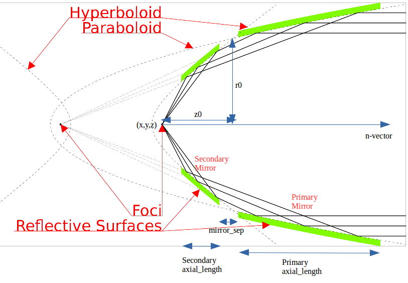
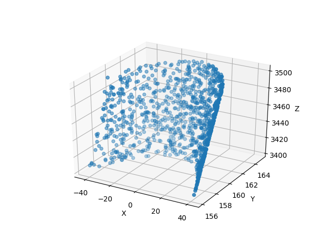
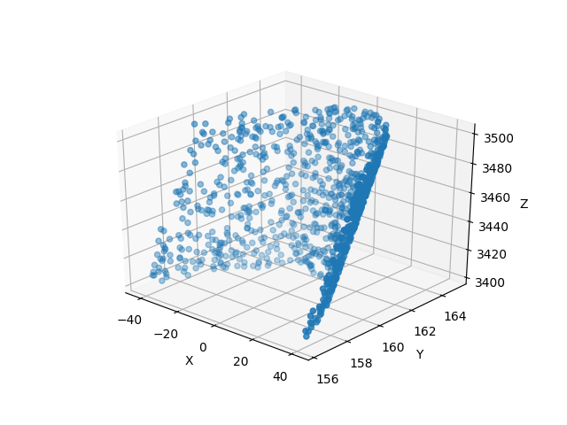
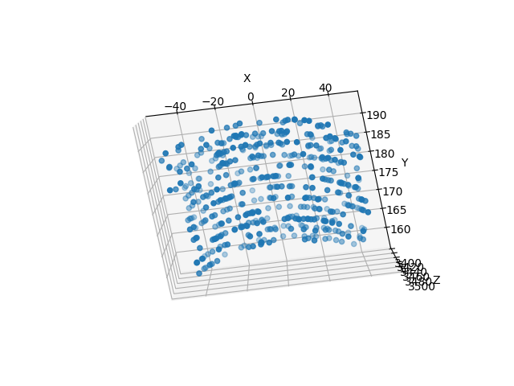

.. _wolter-top:

Wolter Optics
=======================

WolterOptic is the file which stores all of the objects that simulate parts of Wolter Telescopes. The following classes are found within the file:

* :ref:`WolterPrimary<wolter-primary>`
* :ref:`WolterSecondary<wolter-secondary>`
* :ref:`WolterTypeOne<wolter-typeone>`
* :ref:`WolterModule<wolter-module>`

The WolterOptic class can be initialized, but is lacks a trace function. So it cannot be used in an Instrument object and rays cannot be traced manually. However, it does contain parameters and functions that are shared by all of its subclasses.

Creating a Wolter Optic
--------------------------

.. _wolter-optic-params:

A WolterOptic object requires the following arguments

* x,y,z - The position in Cartesian Coordinates of the Component's focus.
   * These parameters must be in units of length. See the section on Astropy Units.
* nx,ny,nz - These three quantities describe the vector which extends outward from the Component's focus. nx, ny, and nz describe the distance that the vector extends in the x, y, and z directions, respectively. This vector is denoted as the positive z-axis in the mirrors coordinate system.
* r0 - The radius of the Component at the point where the primary and secondary mirror converge.
   * r0 must be in units of length. See the section on Astropy Units.
* z0 - The distance from the focus (in the n-direction) of the intersection of the primary and secondary mirrors.
   * z0 must be in units of length. See the section on Astropy Units.
* axial\_length - The length of the mirror in the n-direction, defaults to None.
   * axial\_length must be in units of length. See the section on Astropy Units.
* mirror\_sep - The separation between the primary and secondary mirrors in the n-direction, defaults to None.
   * mirror\_sep must be in units of length. See the section on Astropy Units.

Note: If both axial_length and mirror_sep are None, the mirror will extend infinitely, no rays will miss such a mirror.
 

The diagram below shows how the parameters are used.
Note that all variants of this image are adapted from the original image created by Andreas 9384 - Own work, CC BY-SA 4.0, https://commons.wikimedia.org/w/index.php?curid=54729753.

WolterOptic and all of its subclasses are located in the WolterOptic file, so importing the classes and initializing an object uses the following syntax:

.. code-block:: python

   from prtp.WolterOptic import WolterOptic
   w = WolterOptic(x=0*u.mm,y=0*u.mm,z=0*u.mm,nx=0,ny=0,nz=1,
   r0=165*u.mm,z0=3500*u.mm,axial_len=100*u.mm,mirror_sep=1*u.mm)

Moving Wolter Optics
------------------------

.. _wolter-optic-motion:

Translate
***********

translate(self,dx=0*u.mm,dy=0*u.mm,dz=0*u.mm)

This function moves the center of the component in space, it takes arguments:

* dx,dy,dz - The amount by which you want to move the mirror's focus in the x, y, and z directions, respectively.
   * These parameters must be in units of length. See the section on Astropy units

Example: Take the WolterOptic we defined before and move it 2 mm in x and -3 mm in y.

.. code-block:: python

   import astropy.units as u   
   from prtp.WolterOptic import WolterOptic

   w = WolterOptic(x=0*u.mm,y=0*u.mm,z=0*u.mm,nx=0,ny=0,nz=1,
   r0=165*u.mm,z0=3500*u.mm,axial_len=100*u.mm,mirror_sep=1*u.mm)

   w.translate(dx=2*u.mm,dy=-3*u.mm)

:ref:`Back to Top<wolter-top>`

Unit Rotate
**************

unitrotate(self,theta=0*u.rad,axis=1)

This function rotates the Wolter Optic about one of the unit axes. Since the only vector is the n-vector, this is what it rotated. It takes arguments:

* theta - The amount that you want to rotate about the specified axis.
    * This parameter must be in units of angle. See the section on Astropy units
* axis - An integer that should take the values 1,2, or 3. 
   * If axis = 1: The mirror will be rotated about the x-axis
   * If axis = 2: The mirror will be rotated about the y-axis
   * If axis = 3: The mirror will be rotated about the z-axis

Note: All rotations are performed in a right-handed fasion, that is, according to the right hand rule where your thumb is the axis of rotation and your fingers curl in the direction of positive rotation.

Example: Let's take the Wolter Optic we defined at first and rotate it 20 degrees about the y-axis.

.. code-block:: python

   import astropy.units as u
   from prtp.WolterOptic import WolterOptic

   w = WolterOptic(x=0*u.mm,y=0*u.mm,z=0*u.mm,nx=0,ny=0,nz=1,
   r0=165*u.mm,z0=3500*u.mm,axial_len=100*u.mm,mirror_sep=1*u.mm)

   w.unitrotate(theta=20*u.deg,axis=2)

:ref:`Back to Top<wolter-top>`

Rotate
**********

rotate(self,theta=0*u.rad,ux=1,uy=0,uz=0)

This function rotates the Wolter Optic about an arbitrary, user-defined axis. It takes arguments:

* theta - The amount that you want to rotate about the user-defined axis.
    * This parameter must be in units of angle. See the section on Astropy units
* ux,uy,uz - These three parameters define the axis about which you want to rotate. ux, uy, and uz describe the distance that the vector extends in the x, y, and z directions, respectively.

Note: The rotation is performed in a right-handed fasion, that is, according to the right hand rule where your thumb is the axis of rotation and your fingers curl in the direction of positive rotation.

Note: The magnitude of the vector does not matter, only its direction.

Example: Let's take the mirror we defined at first and rotate it 40 degrees about the vector <1,1,0>

.. code-block:: python

   import astropy.units as u
   from prtp.WolterOptic import WolterOptic

   w = WolterOptic(x=0*u.mm,y=0*u.mm,z=0*u.mm,nx=0,ny=0,nz=1,
   r0=165*u.mm,z0=3500*u.mm,axial_len=100*u.mm,mirror_sep=1*u.mm)

   w.rotate(theta=40*u.deg,ux=1,uy=1,uz=0)

:ref:`Back to Top<wolter-top>`

.. _wolter-primary: 

Wolter Primary
------------------

A subclass of WolterOptic, these objects simulate only the primary mirror (the paraboloid) in a Wolter Telescope.

Creating a Wolter Primary Mirror
*********************************

WolterPrimary takes in the same arguments as Wolter Optic, the list of these arguments can be found :ref:`here <wolter-optic-params>`.

Moving Wolter Primaries
**************************

WolterPrimary objects inherit translate, unitrotate, and rotate from the WolterOptic superclass. Documentation on these functions' uses can be found :ref:`here <wolter-optic-motion>`

Trace
********

trace is the function used to actually move rays to the surface of the primary mirror. Photons which miss the axial_length of the mirror will be removed. trace takes the following arguments:

* rays - The Rays object containing the photons that you want to trace.
* autoreflect - A boolean. If True, photons will automatically be reflecting by the call to trace(). If False, photons will only be traced to the surface, but not reflected. Defaults to True, and the default argument is always used in Instrument objects.
   * Note that even if autoreflect is False, the surface normal parameters of the rays will be updated by the call to trace(), so you can reflect them manually by calling rays.reflect() after calling trace().
* considerweights - This is a boolean which should be true if your photons are weighted. WolterPrimary objects currently don't have support for reflectivities, so this argument has ne effect on the tracing.
* eliminate - This is an argument of every trace function. It is a string which defaults to "remove". If it is the default value, photons which are eliminated will be removed from the Rays object. If it is anything else, the x-position of the missed photons will be set to NaN. This argument is mostly used by Combination objects.

Example Code:

.. code-block:: python

   from prtp.Sources import Subannulus
   from prtp.WolterOptic import WolterPrimary

   source = Subannulus(1000,165*u.mm, 166.2*u.mm, 30*u.deg,
      wave=0.83401*u.nm,order=-1)

   w = WolterPrimary(x=0*u.mm,y=0*u.mm,z=0*u.mm,nx=0,ny=0,nz=1,
      r0=165*u.mm,z0=3500*u.mm,axial_length=100*u.mm,mirror_sep=1*u.mm)

   rays = source.generateRays()

   w.trace(rays)

   rays.scatter3d()

The above block of code will produce the following plot:

.. figure:: ../images/wolter_primary_trace.png

:ref:`Back to Top<wolter-top>`

.. _wolter-secondary: 

Wolter Secondary
-------------------

A subclass of WolterOptic, these objects simulate only the secondary mirror (the hyperboloid) in a Wolter Telescope.

Creating a Wolter Secondary Mirror
*************************************

WolterSecondary takes in the same arguments as Wolter Optic, the list of these arguments can be found :ref:`here <wolter-optic-params>`.

Moving Wolter Secondaries
****************************

WolterSecondary objects inherit translate, unitrotate, and rotate from the WolterOptic superclass. Documentation on these functions' uses can be found :ref:`here <wolter-optic-motion>`

Trace
************

trace is the function used to actually move rays to the surface of the primary mirror. Photons which miss the axial_length of the mirror will be removed. trace takes the following arguments:

* rays - The Rays object containing the photons that you want to trace.
* autoreflect - A boolean. If True, photons will automatically be reflecting by the call to trace(). If False, photons will only be traced to the surface, but not reflected. Defaults to True, and the default argument is always used in Instrument objects.
   * Note that even if autoreflect is False, the surface normal parameters of the rays will be updated by the call to trace(), so you can reflect them manually by calling rays.reflect() after calling trace().
* considerweights - This is a boolean which should be true if your photons are weighted. WolterSecondary objects currently don't have support for reflectivities, so this argument has ne effect on the tracing.
* eliminate - This is an argument of every trace function. It is a string which defaults to "remove". If it is the default value, photons which are eliminated will be removed from the Rays object. If it is anything else, the x-position of the missed photons will be set to NaN. This argument is mostly used by Combination objects.

Example Code:

.. code-block:: python

   from prtp.Sources import Subannulus
   from prtp.WolterOptic import WolterPrimary

   source = Subannulus(1000,165*u.mm, 166.2*u.mm, 30*u.deg,
      wave=0.83401*u.nm,order=-1)

   wprim = WolterPrimary(x=0*u.mm,y=0*u.mm,z=0*u.mm,nx=0,ny=0,nz=1,
      r0=165*u.mm,z0=3500*u.mm,axial_length=100*u.mm,mirror_sep=1*u.mm)
   wsec = WolterSecondary(x=0*u.mm,y=0*u.mm,z=0*u.mm,nx=0,ny=0,nz=1,
      r0=165*u.mm,z0=3500*u.mm,axial_length=100*u.mm,mirror_sep=1*u.mm)

   rays = source.generateRays()

   wprim.trace(rays)
   wsec.trace(rays)

   rays.scatter3d()

The above block of code traces rays through both a primary and a secondary mirror and will produce the following plot:

:ref:`Back to Top<wolter-top>`

.. _wolter-typeone: 

Wolter Type One
-------------------

A subclass of WolterOptic, these objects simulate both the primary and secondary mirrors of a Wolter Telescope

Creating a Wolter Type One Object
***********************************

WolterSecondary takes in most of the same arguments as Wolter Optic, the list of these arguments can be found :ref:`here <wolter-optic-params>`.

However, there are four new arguments that are present in WolterTypeOne objects, they are:

* beckmann_scatter - A boolean. If True, beckmann scattering will be added to the rays ftaer they reflect off the primary mirror. If False, no scattering will be added.
* h, rho, ripple - These are the three parameters that are passed to the rays.beckmann_scatter() function. h is the rms surface height roughness, rho is the correlation length, and ripple scales the scattering in the output.

Note that if you were to use Wolter Primary and Wolter Secondary objects separately, beckmann scattering would have to be added as a Modification object between them.

When to Use Wolter Type One Objects
************************************

Since Wolter Type One objects are singular objects that have the effect as two other mirrors, using Type One objects can make your code look cleaner. Also, Type One objects only have to transform the Rays into the mirror's coordinate system once, so using Type One objects over Primary and Secondary objects can speed up your simulation.

While you can translate and rotate the Type One object itself, there is no way to move one part of the Type One object but not the other. For example, you cannot misalign the primary mirror while maintaning alignment in the secondary mirror. Doing this requires separate primary and secondary mirror objects.

Moving Wolter Type One Objects
********************************

WolterTypeOne objects inherit translate, unitrotate, and rotate from the WolterOptic superclass. Documentation on these functions' uses can be found :ref:`here <wolter-optic-motion>`

Trace
********

trace is the function used to actually move rays to the surface of the primary mirror. Photons which miss the axial_length of the mirror will be removed. trace takes the following arguments:

* rays - The Rays object containing the photons that you want to trace.
* autoreflect - A boolean. If True, photons will automatically be reflecting by the call to trace(). If False, photons will only be traced to the surface, but not reflected. Defaults to True, and the default argument is always used in Instrument objects.
   * Note that even if autoreflect is False, the surface normal parameters of the rays will be updated by the call to trace(), so you can reflect them manually by calling rays.reflect() after calling trace().
* considerweights - This is a boolean which should be true if your photons are weighted. WolterSecondary objects currently don't have support for reflectivities, so this argument has ne effect on the tracing.
* eliminate - This is an argument of every trace function. It is a string which defaults to "remove". If it is the default value, photons which are eliminated will be removed from the Rays object. If it is anything else, the x-position of the missed photons will be set to NaN. This argument is mostly used by Combination objects.

Example Code:

.. code-block:: python

   from prtp.Sources import Subannulus
   from prtp.WolterOptic import WolterTypeOne

   source = Subannulus(1000,165*u.mm, 166.2*u.mm, 30*u.deg,
      wave=0.83401*u.nm,order=-1)

   wt1 = WolterTypeOne(x=0*u.mm,y=0*u.mm,z=0*u.mm,nx=0,ny=0,nz=1,
      r0=165*u.mm,z0=3500*u.mm,axial_length=100*u.mm,mirror_sep=1*u.mm)

   rays = source.generateRays()

   wt1.trace(rays)

   rays.scatter3d()

The above block of code traces rays through both a primary and a secondary mirror and will produce the following plot:

Note that this is the same plot produced by WolterPrimary and WolterSecondary objects, but this block used simpler code with only one Wolter object.

:ref:`Back to Top<wolter-top>`

.. _wolter-module: 

Wolter Modules
-----------------

Wolter Modules are subclasses of both WolterOptic and Combination. They consist of many nested Wolter Type One mirrors. These mirrors must all share the same focus and n-vector, but can have different values for r0, z0, axial_len, and mirror_sep.

When compared to general Combination objects, Wolter Modules are specialized in that they only contain Wolter Type One objects, but they can be initialized in a single line containing all of the mirrors.

Note: It is possible to put components other than WolterTypeOne into the componentlist of a Wolter Module, but to do so requires the use of the addComponent() function inherited from Combination. At this point, there is no benefit gained by using a Wolter Module over a Combination object.

Creating a Wolter Module Object
***********************************

WolterSecondary takes in most of the same arguments as Wolter Optic, the list of these arguments can be found :ref:`here <wolter-optic-params>`.

However, there are four new arguments that are present in WolterModule objects, they are:

* beckmann_scatter - A boolean. If True, beckmann scattering will be added to the rays ftaer they reflect off the primary mirror. If False, no scattering will be added.
* h, rho, ripple - These are the three parameters that are passed to the rays.beckmann_scatter() function. h is the rms surface height roughness, rho is the correlation length, and ripple scales the scattering in the output.

Note that if you were to use Wolter Primary and Wolter Secondary objects separately, beckmann scattering would have to be added as a Modification object between them.

Moving Wolter Module Objects
********************************

WolterTypeOne objects inherit translate, unitrotate, and rotate from the WolterOptic superclass. Documentation on these functions' uses can be found :ref:`here <wolter-optic-motion>`. These functions will move the shared focus and n-vector of the mirrors in the module.

Descending from Combination, WolterModule also inherits defineRotationPoint, as well as separate versions of rotate and unitrotate. If you wish to call these functions, you must use the alternate syntax:

.. code-block:: python

   from prtp.Combination import Combination
   from prtp.WolterOptic import WolterModule
   import astropy.units as u

   # Generate the Wolter Module
   r0s = np.array([165., 167.5503, 170.1193, 172.7023,
                  175.3143, 177.9404, 180.5859, 183.2509,
                  185.9355, 188.6398, 191.3640, 194.1083]) * u.mm

   z0s = np.ones(12) * 3500. * u.mm
   axlens = np.ones(12) * 100 * u.mm
   mrseps = np.ones(12) * 5 * u.mm
   wm = WolterModule(r0=r0s,z0=z0s,axial_length=axlens,mirror_sep=mrseps,
      beckmann_scatter=True,ripple=1.5e-5)

   # Move the Wolter Module
   wm.defineRotationPoint(0*u.mm,0*u.mm,0*u.mm)
   Combination.unitrotate(wm,20*u.deg,1)
   

Trace
*******

trace is the function used to actually move rays to the surface of the primary mirror. Photons which miss the axial_length of the mirror will be removed. trace takes the following arguments:

* rays - The Rays object containing the photons that you want to trace.
* autoreflect - A boolean. If True, photons will automatically be reflecting by the call to trace(). If False, photons will only be traced to the surface, but not reflected. Defaults to True, and the default argument is always used in Instrument objects.
   * Note that even if autoreflect is False, the surface normal parameters of the rays will be updated by the call to trace(), so you can reflect them manually by calling rays.reflect() after calling trace().
* considerweights - This is a boolean which should be true if your photons are weighted. WolterSecondary objects currently don't have support for reflectivities, so this argument has ne effect on the tracing.
* eliminate - This is an argument of every trace function. It is a string which defaults to "remove". If it is the default value, photons which are eliminated will be removed from the Rays object. If it is anything else, the x-position of the missed photons will be set to NaN. This argument is mostly used by Combination objects.

Example Code (adapted from "Woltermodulexample" in the examples folder):

.. code-block:: python

   from prtp.Subannulus import Subannulus
   from prtp.WolterOptic import WolterModule

   r = Subannulus(1000,rp_back, rp_front, np.radians(30.)*u.rad)

   # r0, z0, ax_len, and mir_sep must all be arrays for Wolter Modules
   # This allows one object to contain many different mirrors at once
   r0s = np.array([165., 167.5503, 170.1193, 172.7023,
                  175.3143, 177.9404, 180.5859, 183.2509,
                  185.9355, 188.6398, 191.3640, 194.1083]) * u.mm

   z0s = np.ones(12) * 3500. * u.mm
   axlens = np.ones(12) * 100 * u.mm
   mrseps = np.ones(12) * 5 * u.mm

   # Generate the Wolter Module
   wm = WolterModule(r0=r0s,z0=z0s,axial_length=axlens,mirror_sep=mrseps,
      beckmann_scatter=True,ripple=1.5e-5)

   rays = r.generateRays()
   wm.trace(rays)
   rays.scatter3d()

The above block of code traces rays through the module and will produce the following plot:

Looking downwards on the rays shows that they have been traced to nested Wolter Type One objects

:ref:`Back to Top<wolter-top>`

